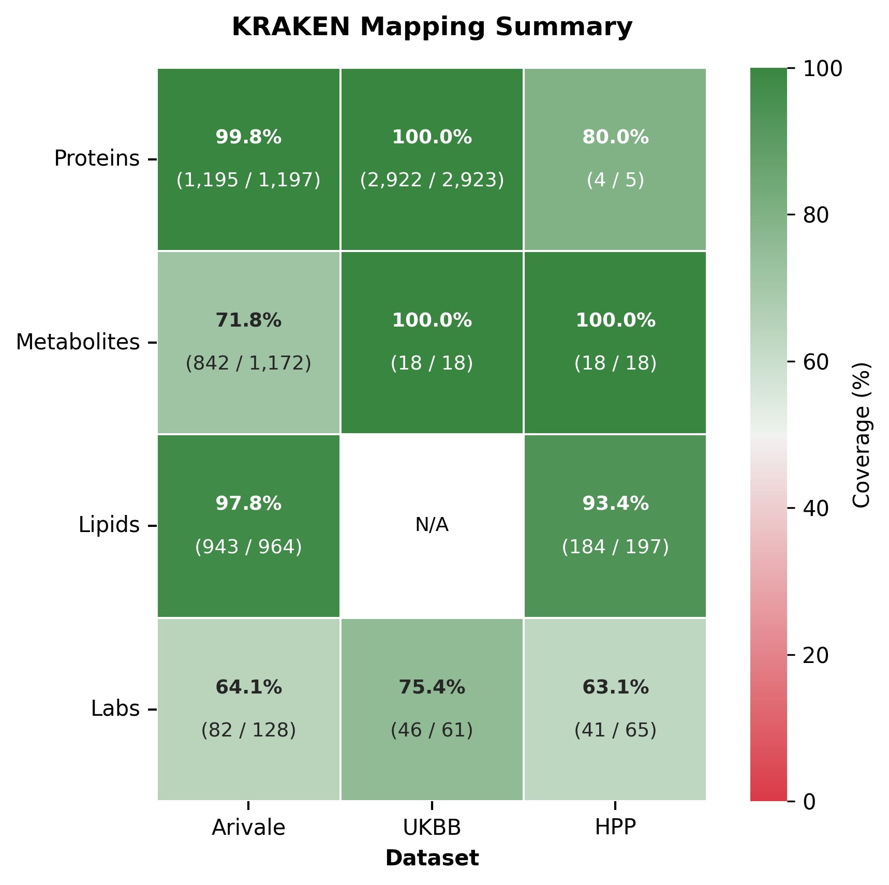

# biomapper2


This is a package for mapping **biomedical entities** to the KRAKEN knowledge graph, whether starting from text names or vocabulary/ontology IDs (local IDs or CURIEs).

It supports both **single-entity** lookups and **dataset-level** batch processing, and does:

1. **entity linking** (text name → CURIE)
2. **ID normalization** (messy local ID → CURIE)
3. **entity resolution** (CURIE → canonical CURIE, by leveraging the CURIE equivalencies in the KRAKEN knowledge graph)

All CURIEs are represented in [Biolink](https://github.com/biolink/biolink-model/tree/master/src/biolink_model/prefixmaps)-standard format.

⚠️ **Note**: This package is in active development. Feedback and issues welcome!

### Quick access via PyPI

If you just want to **map entities against the hosted production API** without running your own server, install the lightweight client package:

```bash
pip install ddharmon
```

See [ddharmon on PyPI](https://pypi.org/project/ddharmon/) for usage. It wraps the same REST API documented below, pointed at the production Kestrel instance.

## Setup

### Install uv (if not already installed)

**macOS/Linux:**
```bash
curl -LsSf https://astral.sh/uv/install.sh | sh
```

For other platforms, see [uv installation docs](https://docs.astral.sh/uv/getting-started/installation/).

### Clone and install
```bash
git clone https://github.com/Phenome-Health/biomapper2.git
cd biomapper2
uv sync --dev
```

This will create a virtual environment and install all dependencies.

Then create a `.env` file from the template:
```bash
cp .env.example .env
```
Edit `.env` to fill in your `KESTREL_API_KEY`. The file also contains `KESTREL_API_URL` and optional API authentication settings — see the comments in `.env.example` for details.

Then [run the pytest suite](#run-tests) to confirm all is working.

## Usage

### Map a single entity to knowledge graph

```python
from biomapper2.mapper import Mapper

mapper = Mapper()

item = {
    'name': 'carnitine',
    'kegg': ['C00487'],
    'pubchem': '10917'
}

mapped_item = mapper.map_entity_to_kg(
    item=item,
    name_field='name',
    provided_id_fields=['kegg', 'pubchem'],
    entity_type='metabolite'
)
```

### Map a dataset to knowledge graph

```python
from biomapper2.mapper import Mapper

mapper = Mapper()

mapper.map_dataset_to_kg(
    dataset='data/examples/olink_protein_metadata.tsv',
    entity_type='protein',
    name_column='Assay',
    provided_id_columns=['UniProt'],
    array_delimiters=['_']
)
```
See `examples/` for complete working examples.

## REST API

biomapper2 includes a FastAPI server that exposes the mapping pipeline over HTTP.

### Run the server

```bash
# Local development (with hot reload)
uv run uvicorn biomapper2.api.main:app --reload --port 8001

# Or via Docker
docker compose --profile prod up -d
```

The API docs are available at:
- **Swagger UI**: http://localhost:8001/api/v1/docs
- **ReDoc**: http://localhost:8001/api/v1/redoc
- **OpenAPI spec**: http://localhost:8001/api/v1/openapi.json

### Endpoints

| Method | Endpoint | Description |
|--------|----------|-------------|
| GET | `/api/v1/health` | Health check (no auth required) |
| GET | `/api/v1/entity-types` | List supported entity types |
| GET | `/api/v1/annotators` | List available annotators |
| GET | `/api/v1/vocabularies` | List supported vocabularies |
| POST | `/api/v1/map/entity` | Map a single entity |
| POST | `/api/v1/map/batch` | Map multiple entities (max 1000) |
| POST | `/api/v1/map/dataset` | Map an uploaded TSV/CSV file |
| POST | `/api/v1/map/dataset/stream` | Stream mapping results as NDJSON |

### Authentication

Set `BIOMAPPER_API_KEY` or `BIOMAPPER2_API_KEYS` (comma-separated) in your `.env` file to require API key authentication via the `X-API-Key` header. If no keys are configured, the API runs in open-access mode.

## Docker

### Quick start

```bash
cp .env.example .env    # then edit .env with your KESTREL_API_KEY

docker compose --profile prod up -d
curl http://localhost:8001/api/v1/health
```

### Development

```bash
# Start with live code reload (mounts src/ and tests/)
docker compose --profile dev up

# Run tests inside the container
docker compose --profile dev run --rm biomapper2-dev uv run pytest -m "not integration" -v

# Run quality checks
docker compose --profile dev run --rm biomapper2-dev ./scripts/check.sh
```

### Building manually

```bash
docker build --target prod -t biomapper2 .       # Production image
docker build --target dev -t biomapper2:dev .     # Development image
```

### Generate KG-performance across datasets
```python

from biomapper.visualizer import Visualizer

viz = Visualizer()

# collect metrics from jsons named {dataset}_{entity}_MAPPED_a_summary_stats.json
stats_df = viz.aggregate_stats(
    stats_dir='data/examples/synthetic_stats/'
)

viz.render_heatmap(
    df=stats_df,
    output_path='docs/assets/comparison_viz' # defaults to producing pdf and png, configurable via Visualizer(
)
```
<p align="center">
    
</p>

## Run examples
```bash
uv run python examples/basic_entity_kg_mapping.py
uv run python examples/basic_dataset_kg_mapping.py
```

## Run tests
```bash
uv run pytest          # Run all tests
uv run pytest -v       # Run with verbose output
uv run pytest -vs      # Run with verbose output and logging/prints displayed
```

**Note:** Tests run automatically on every commit via GitHub Actions (CI/CD).

## Development

### Quick Start

Run all code quality checks before committing:
```bash
./scripts/check.sh     # Run ruff, black, pyright, and pytests
./scripts/fix.sh       # Auto-fix formatting and linting issues
```

**For detailed contribution guidelines, code style standards, and workflow practices, see [docs/CONTRIBUTING.md](docs/CONTRIBUTING.md).**

## Project structure
```
src/biomapper2/
├── mapper.py                   # Main Mapper class - entry point for entity/dataset mapping
├── models.py                   # Pydantic Entity model for type-safe pipeline processing
├── config.py                   # Configuration (KG API endpoint, logging, etc.)
├── api/                        # FastAPI REST API
│   ├── main.py                 # Application setup, middleware, lifespan
│   ├── auth.py                 # API key authentication
│   ├── models/                 # Request/response Pydantic models
│   └── routes/                 # Endpoint implementations (mapping, discovery)
├── core/
│   ├── annotation_engine.py    # Orchestrates annotation of entities with ontology local IDs
│   ├── annotators/             # Individual annotator implementations (Kestrel text search, etc.)
│   │   ├── base.py             # Base annotator interface
│   │   └── kestrel_text.py     # Kestrel text search annotator
│   ├── normalizer/             # ID normalization package
│   │   ├── normalizer.py       # Main Normalizer class
│   │   ├── validators.py       # ID validation functions for different vocabularies
│   │   ├── cleaners.py         # ID cleaning/standardization functions
│   │   └── vocab_config.py     # Biolink prefix mappings and validator configurations
│   ├── linker.py               # Links curies to knowledge graph nodes
│   └── resolver.py             # Resolves one-to-many entity→KG matches
├── utils.py                    # Utility functions
└── visualizer.py               # Visualize KG performance across datasets

Dockerfile                      # Multi-stage build (builder → dev → prod)
compose.yaml                    # Docker Compose with prod and dev profiles
examples/                       # Working code examples
tests/                          # Pytest test suite
data/                           # Example and groundtruth datasets
scripts/                        # Development scripts (check.sh, fix.sh)
```

### Configuration

Environment variables (set in `.env`):
- `KESTREL_API_URL` - Knowledge graph API endpoint (defaults to production)
- `KESTREL_API_KEY` - API key for the Kestrel API

Additional settings in `src/biomapper2/config.py`:
- `BIOLINK_VERSION_DEFAULT` - Default Biolink model version
- `LOG_LEVEL` - Logging verbosity (DEBUG, INFO, WARNING, ERROR, CRITICAL)
